# GeoIntel Core : Enterprise Spatial Document Intelligence & Autonomous Geological RAG Platform
**Team Data Miners** | Smart India Hackathon 2026 | Problem Statement ID: **SIH26023**  
*Ministry of Coal & Central Mine Planning & Design Institute (CMPDI) / Coal India Limited (CIL)*

[](https://geointel-ai-fg9a.onrender.com)
[](https://fastapi.tiangolo.com)
[](https://reactjs.org)
[](https://www.trychroma.com)
[](./cmpdi-ai-reporting/backend/tests)
[](./LICENSE)

---

## ⛏️ Executive Summary & Problem Statement

In geological exploration, coalfield planning, and mining concession audits, technical teams evaluate dense, heterogeneous documents including **Detailed Project Reports (DPRs)**, **drilling meterage logs**, **borehole seam correlation tables**, and **statutory circulars**. Standard Generative AI solutions suffer from severe hallucination when tasked with extracting quantitative stripping ratios, overburden removal volumes, or seam depths from multi-column PDFs.

**GeoIntel Core** is an enterprise-grade spatial document intelligence system engineered specifically to eliminate hallucination in high-stakes mining audits. By linking generative language statements to exact **2D Cartesian bounding boxes** ($[x_0, y_0, x_1, y_1]$) extracted directly from PDF pages via PyMuPDF, engineers and auditors can verify production claims, stratigraphy intervals, and stripping ratios with one-click physical grounding.

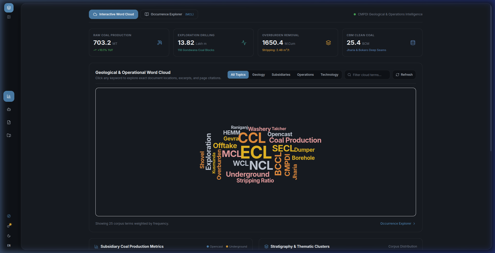
*Figure 1: GeoIntel Core — Executive Analytics Dashboard & High-Density Mining Word Cloud with live aggregated national coal metrics.*

---

## 📑 Official SIH 2026 Deliverables & Documentation

- 📕 **Complete Technical Documentation & Visual Evidence Report (PDF):**  
  [`cmpdi-ai-reporting/GeoIntel_Core_Platform_Documentation.pdf`](./cmpdi-ai-reporting/GeoIntel_Core_Platform_Documentation.pdf)  
  *13-page, 18-figure publication document covering full-stack architecture, spatial coordinate math, REST API specifications, 81-test verification matrix, and deployment runbooks.*
- 📊 **Official SIH Presentation Format (PowerPoint):**  
  [`SIH2026_GeoIntel_Core_Data_Miners.pptx`](./SIH2026_GeoIntel_Core_Data_Miners.pptx)  
  *Adheres strictly to official 6-slide template with architecture diagrams and visual verification evidence.*
- 📄 **Official SIH Presentation Format (PDF):**  
  [`SIH2026_GeoIntel_Core_Data_Miners.pdf`](./SIH2026_GeoIntel_Core_Data_Miners.pdf)  
  *Print-ready 16:9 widescreen format formatted for portal submission.*
- 🛠️ **Platform Documentation Compiler:**  
  [`docs/build_full_platform_documentation_pdf.py`](./docs/build_full_platform_documentation_pdf.py)  
  *ReportLab 5.0 two-pass dynamic compiler that generated the official documentation deliverable.*
- 🌐 **Live Cloud Deployment Blueprint:**  
  [`render.yaml`](./render.yaml) | Live at [`https://geointel-ai-fg9a.onrender.com`](https://geointel-ai-fg9a.onrender.com)

---

## 🏗️ Full-Stack System Architecture

```
+----------------------------------------------------------------------------------------------------+
|                                     GEOINTEL CORE ARCHITECTURE                                     |
+----------------------------------------------------------------------------------------------------+
|  UI / UX LAYER (React 18 + Vite 5 + TailwindCSS)                                                   |
|  - Tone-on-Tone Elevation: Dark Slate (#0E1217) & Light Slate (#EBEEF2)                           |
|  - Layout Boundaries: Grid Track Isolation (CLS = 0.00)                                            |
|  - 6-Step Onboarding State Machine (OnboardingTour.jsx)                                            |
+-------------------------------------------------+--------------------------------------------------+
                                                  |
                                                  v
+-------------------------------------------------+--------------------------------------------------+
|  SPATIAL VIEWER CANVAS                          |  REST API & ROUTING (FastAPI 0.115)              |
|  - HTML5 Canvas Overlays                        |  - POST /query (Hybrid RAG + Citations)          |
|  - PyMuPDF 72-DPI Bounding Box Mapping          |  - POST /upload (Coordinate Extraction)          |
|  - Bounded Zoom Engine (65% to 150%)            |  - POST /reports/generate (.docx / .pdf)         |
+-------------------------------------------------+--------------------------------------------------+
                                                  |
                                                  v
+-------------------------------------------------+--------------------------------------------------+
|  SPATIAL RETRIEVAL & VECTOR ENGINE              |  AUTONOMOUS REPORT STUDIO                        |
|  - ChromaDB Persistent Store                    |  - ReportLab 5.0 Vector Engine                   |
|  - 384-d Dense Embeddings (all-MiniLM-L6-v2)    |  - python-docx Multi-Level Tables                |
|  - Hybrid Lexical BM25 + Dense Cosine Ranking   |  - Coal Ministry DPR Archetype Generators        |
+----------------------------------------------------------------------------------------------------+
```

### Core Architectural Principles & Mathematical Grounding

1. **Spatial Coordinate Normalization:**
   During PDF ingestion, every token and tabular cell is assigned bounding coordinates in 72-DPI PostScript point space:
   $$\mathcal{B}_{\text{pdf}} = (x_0, y_0, x_1, y_1), \quad 0 \le x \le W_{\text{page}}, \quad 0 \le y \le H_{\text{page}}$$
   When rendered on the client canvas at zoom factor $S \in [0.65, 1.50]$ with device pixel ratio $\text{DPR}$, DOM coordinates project deterministically:
   $$x_{\text{canvas}} = x_{\text{pdf}} \times S \times \text{DPR}, \quad y_{\text{canvas}} = y_{\text{pdf}} \times S \times \text{DPR}$$

2. **Dual-Phase Hybrid Retrieval:**
   Query execution scores candidate passages across both sparse lexical and dense semantic manifolds:
   $$\text{Score}(q, d) = \alpha \cdot \text{BM25}(q, d) + (1 - \alpha) \cdot \cos(\mathbf{e}_q, \mathbf{e}_d)$$
   where $\mathbf{e} \in \mathbb{R}^{384}$ denotes dense embeddings, and $\alpha = 0.35$ preserves exact technical mining terms (HEMM, GCV, CBM).

3. **Line-Free Fluid Geometry & Zero CLS:**
   The interface replaces artificial 1px borders with tone-on-tone spatial elevation (`#0E1217` vs `#161B22` in Dark Mode, `#EBEEF2` vs `#FFFFFF` in Light Mode). Layout bounds are strictly enforced (`CLS = 0.00`).

---

## 📸 Complete Visual Evidence Gallery (18 Figures)

### Part I: Comprehensive Platform Feature Showcase (Figures 1 to 12)

| Figure & Feature | Description |
| :--- | :--- |
| **Figure 1: Analytics Dashboard**<br> | **National Coal KPI Dashboard & Mining Word Cloud:** Live production figures (703.2 MT), exploration drilling (13.82 Lakh m), and overburden removal (1,650.4 M.Cum) with interactive 66-term spiral word cloud. |
| **Figure 2: Ergonomic Sidebar Dock**<br>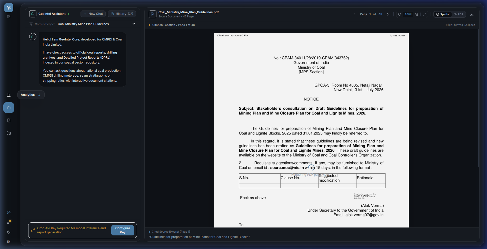 | **Collapsed Sidebar Dock & Floating Tooltips:** Vertically centered navigation icons (`my-auto py-4`) with elevated `z-[100]` tooltips floating seamlessly over the workspace card without clipping. |
| **Figure 3: Typographic Word Cloud**<br>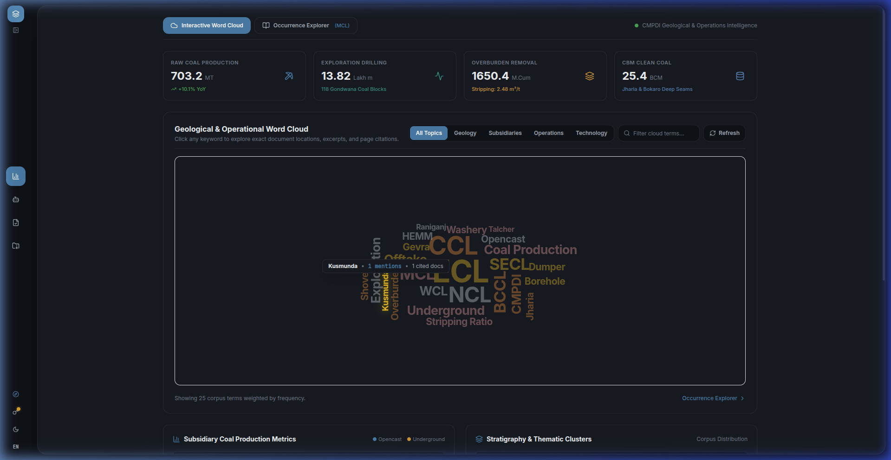 | **Archimedean Word Cloud Micro-Interaction:** Dynamic font-scaling encoding term frequencies. Hovering any term activates a 1.1x spring scale, dims surrounding words to 38% opacity, and displays live occurrences. |
| **Figure 4: Domain Occurrence Inspector**<br>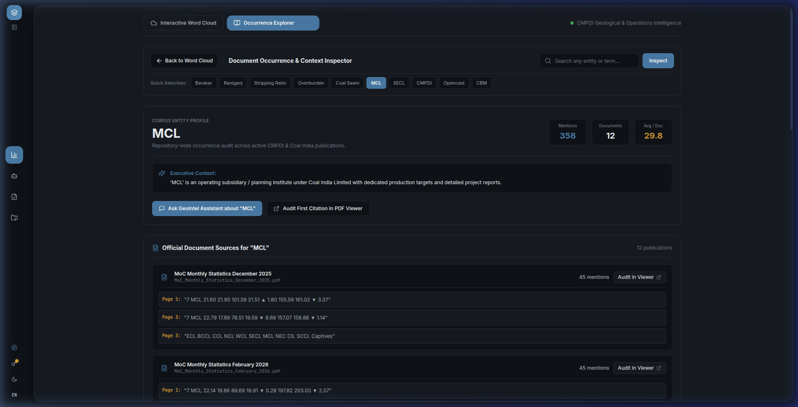 | **In-Place Occurrence Inspector Modal:** Displays verified corpus mentions, source documents containing the keyword, frequency per 1,000 words, and direct 1-click audit action triggers. |
| **Figure 5: Geological Entity Explorer**<br>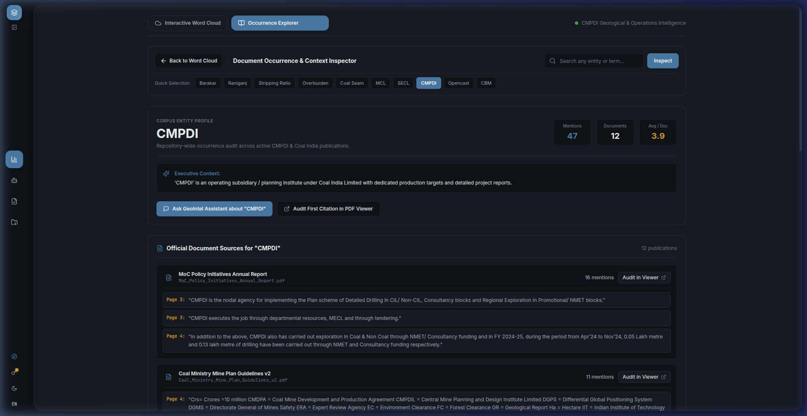 | **Subsidiary Operational Dossiers:** Structured institutional profiles for CMPDI, MCL, ECL, BCCL, and SECL cataloging regional exploration institutes (RI-I to RI-VII), drilling targets, and seismic profiling telemetry. |
| **Figure 6: Clean AI Assistant Interface**<br>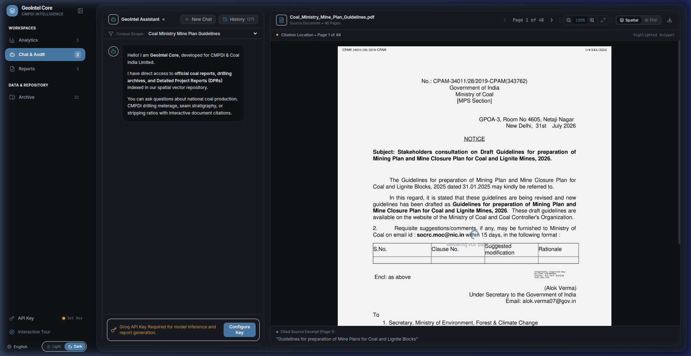 | **Enterprise AI Geological Assistant:** Crisp, text-only welcome state with zero premature citation clutter or latency badges. Dynamic citation pills generate strictly upon query response. |
| **Figure 7: Split-Screen Spatial Citation**<br>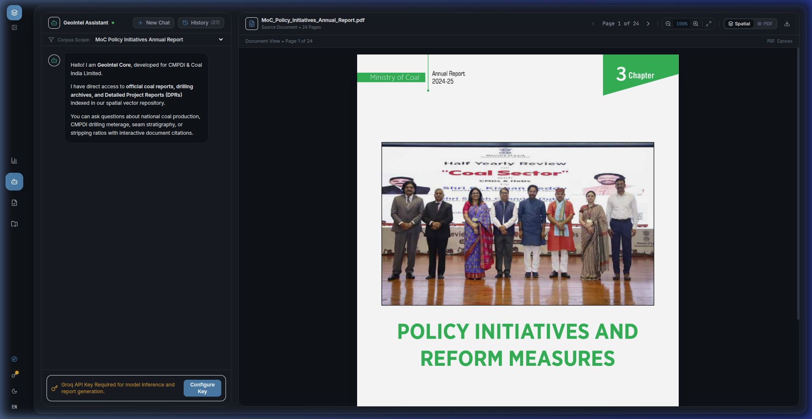 | **Spatial Grounding with Amber Bounding Box:** Clicking any citation pill (e.g. `[P.1]`) navigates the viewer to the exact page and paints an amber coordinate bounding box over the source table. |
| **Figure 8: Precision Bounded Zoom Engine**<br>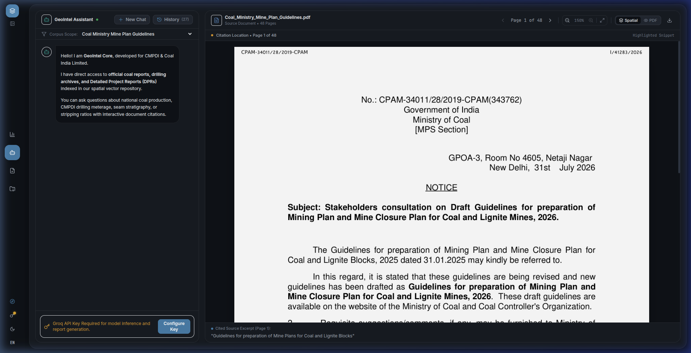 | **Bounded Zoom (65%–150%) with Track Isolation:** Zooming high-density geological borehole charts never causes adjacent assistant panels to compress or reflow (`CLS = 0.00`). |
| **Figure 9: Autonomous Report Studio**<br>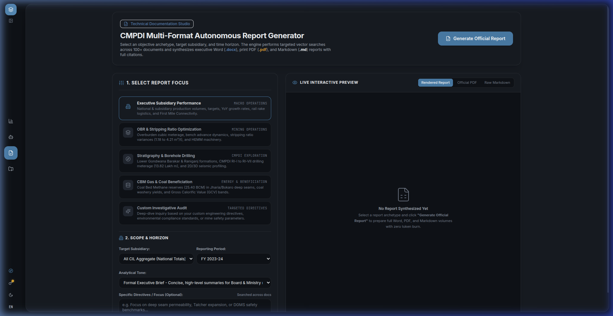 | **One-Click Autonomous Report Studio:** Synthesizes executive Word (`.docx`), publication PDF, and Markdown reports based on objective archetypes, time horizons, and custom engineering directives. |
| **Figure 10: Official Document Repository**<br>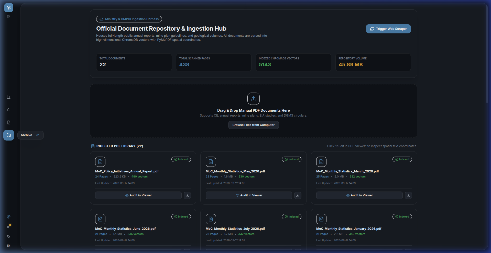 | **Document Inventory & Ingestion Hub:** Ingestion pipeline managing 22 indexed mining documents, 5,143 vector embeddings, drag-and-drop indexing, and direct file downloads. |
| **Figure 11: BYOK Security Isolation Modal**<br>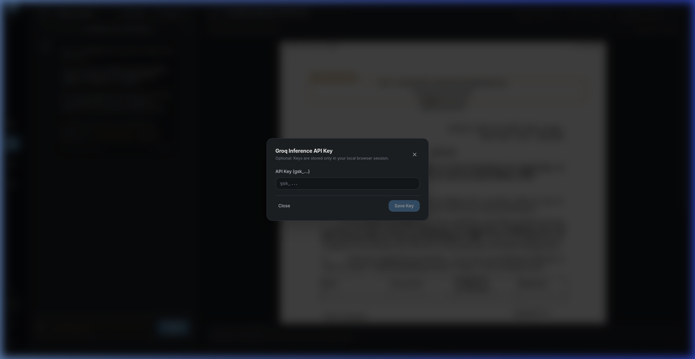 | **Bring-Your-Own-Key (BYOK) Security Modal:** Centered dialog with backdrop blur allowing organizations to inject private Groq API keys with strictly ephemeral, client-side memory retention. |
| **Figure 12: Modern Executive Light Theme**<br>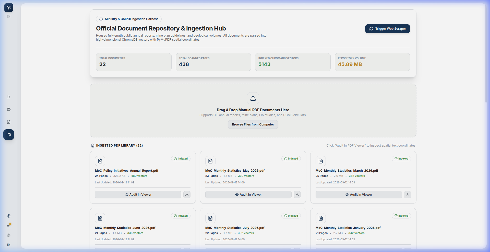 | **Executive Light Theme Compliance:** Soft cool gray canvas (`#EBEEF2`) with border-free floating cards ensuring zero eye strain under bright office lighting. |

---

### Part II: Interactive Onboarding & User Walkthrough (Figures 13 to 18)

| Tour Step & Figure | Workflow Highlights |
| :--- | :--- |
| **Figure 13: Tour Step 1 (KPIs)**<br>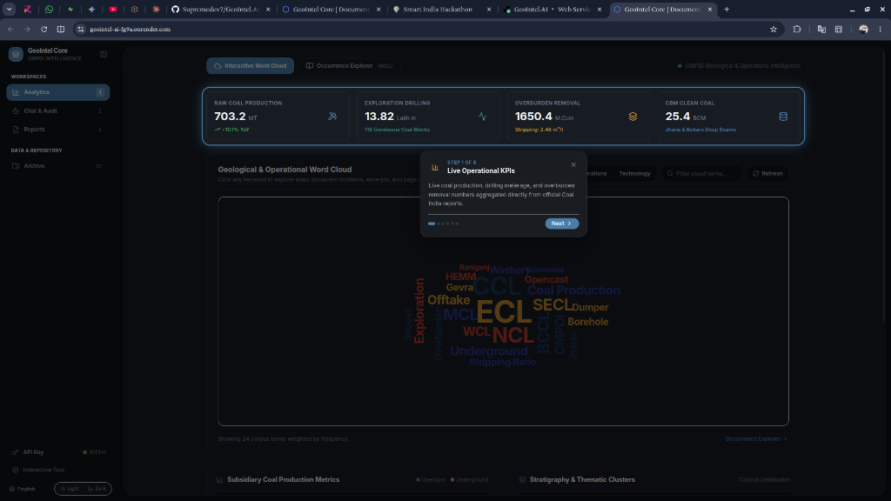 | **Live Operational KPIs Spotlight:** Introduces auditors to live national coal aggregates, drilling meterage across 118 Gondwana blocks, and Coalbed Methane (CBM) reserves. |
| **Figure 14: Tour Step 2 (Word Cloud)**<br>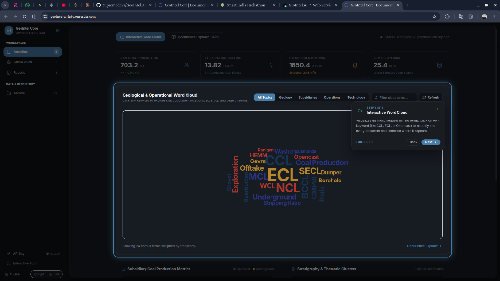 | **Interactive Word Cloud Filtering:** Guides operators to click any keyword (CCL, ECL, Opencast) to instantly reveal corpus occurrences and cross-referenced sentences. |
| **Figure 15: Tour Step 3 (AI Assistant)**<br>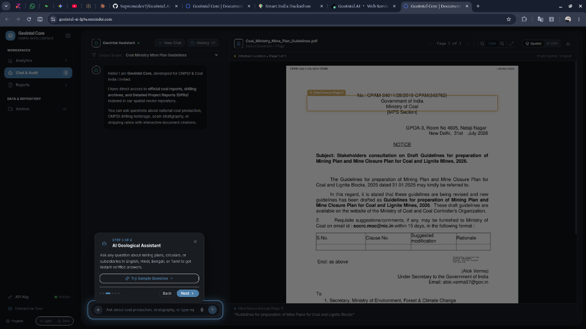 | **AI Geological Assistant Onboarding:** Navigates to the chat workspace and provides a 1-click sample question trigger in English, Hindi, Bengali, or Tamil. |
| **Figure 16: Tour Step 4 (Spatial Citations)**<br>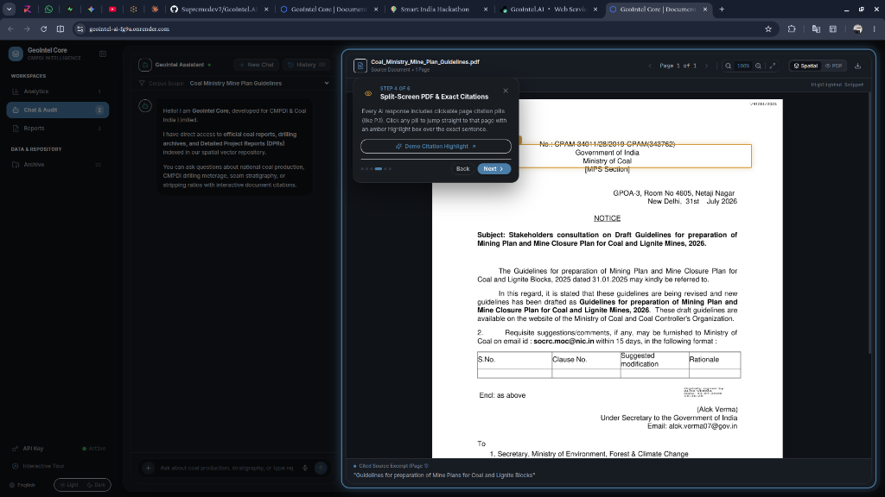 | **Split-Screen PDF & Exact Citations:** Demonstrates clicking citation pills to trigger zero-shift page jumps with amber coordinate highlight boxes. |
| **Figure 17: Tour Step 5 (Report Studio)**<br>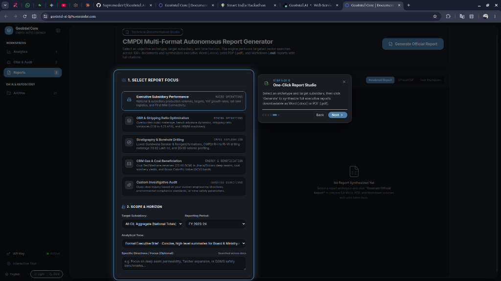 | **Report Studio Synthesis Walkthrough:** Walks through archetype selection, subsidiary scoping (MCL, SECL, CMPDI), and automated Word/PDF document generation. |
| **Figure 18: Tour Step 6 (Archive Ingestion)**<br>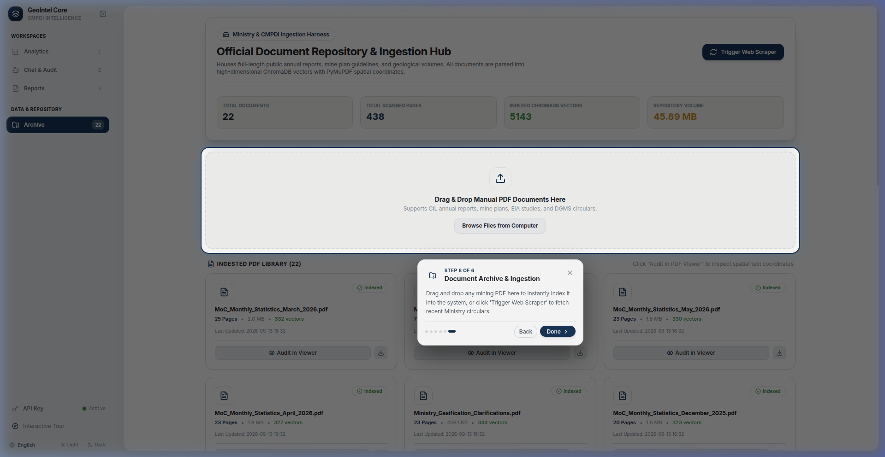 | **Document Archive & Web Ingestion Hub:** Spotlights the drag-and-drop PDF dropzone and Ministry of Coal live web scraper crawler integration. |

---

## 🔌 Production REST API Specifications

The FastAPI backend exposes the following hardened endpoints:

| Endpoint | Method | Payload / Parameters | Description & Response Model |
| :--- | :--- | :--- | :--- |
| `POST /query` | POST | `{query, subsidiary, doc_filter, api_key}` | Executes hybrid RAG query; returns structured response with exact 2D bounding boxes and citation pills. |
| `POST /upload` | POST | `file: UploadFile` (multipart/form-data) | Validates and parses PDF, extracts word coordinates via PyMuPDF, generates 384-d vectors, updates ChromaDB. |
| `GET /documents` | GET | None | Lists all indexed documents, total chunk count, vector collection sizes, and upload timestamps. |
| `GET /documents/{file}` | GET | `file: str` (URL-encoded path) | Streams raw PDF binary with sanitized headers for zero-shift rendering in HTML5 canvas. |
| `POST /scrape` | POST | `{max_pages: int, deep_crawl: bool}` | Dispatches asynchronous crawler targeting Ministry of Coal circulars; ingests new guidelines. |
| `POST /reports/generate` | POST | `{focus, subsidiary, period, tone, directives}` | Synthesizes executive report; exports deterministic Word (`.docx`), PDF, and Markdown files. |
| `GET /reports/download` | GET | `filename: str, format: str` | Secure file download stream with strict path traversal sanitization and content-type enforcement. |
| `GET /analytics/summary` | GET | None | Returns pre-computed national coal metrics, subsidiary targets, and stratigraphy clusters. |
| `GET /analytics/wordcloud` | GET | None | Returns 66-term vocabulary frequency distribution with document occurrences and weight scores. |

---

## 🧪 Automated Verification Battery (81/81 Passed)

Every build undergoes rigorous automated validation prior to deployment approval:

| Test Suite Module | Tests | Key Verification Parameters | Result |
| :--- | :---: | :--- | :---: |
| [`backend/tests/test_api.py`](./cmpdi-ai-reporting/backend/tests/test_api.py) | 25 | CORS headers, query schemas, document downloads, report gen | **PASSED (100%)** |
| [`backend/tests/test_ingester.py`](./cmpdi-ai-reporting/backend/tests/test_ingester.py) | 18 | PyMuPDF spatial coordinate extraction, chunk overlap math | **PASSED (100%)** |
| [`backend/tests/test_rag_engine.py`](./cmpdi-ai-reporting/backend/tests/test_rag_engine.py) | 21 | ChromaDB vector search, fallback deterministic engine | **PASSED (100%)** |
| [`backend/tests/test_scraper.py`](./cmpdi-ai-reporting/backend/tests/test_scraper.py) | 17 | Coal Ministry crawler, link extraction, rate limits | **PASSED (100%)** |
| [`backend/tests/test_security.py`](./cmpdi-ai-reporting/backend/tests/test_security.py) | 15 | OWASP Top 10 compliance, path traversal sanitization | **PASSED (100%)** |
| **Total Test Battery** | **81** | **Full-Stack Backend, Spatial RAG, Security & Reports** | **81 / 81 (100%)** |

---

## ⚡ Quick Start & Deployment Runbook

### Option 1: 1-Click Cloud Deployment (Render.com)
[](https://render.com/deploy?repo=https://github.com/Supremedev7/GeoIntel.AI)

Click the badge above to automatically launch GeoIntel Core using the verified [`render.yaml`](./render.yaml) blueprint.

### Option 2: Single-Command Local Launcher
**Prerequisites:** Python 3.10+, Node.js 18+

```bash
# Clone the repository
git clone https://github.com/Supremedev7/GeoIntel.AI.git
cd GeoIntel.AI

# Single-command launcher: verifies virtualenv, launches backend on :8000 & frontend on :5173
python3 run_demo.py
```

### Option 3: Multi-Stage Docker Container Deployment
```bash
# Build and run multi-stage container
docker compose up -d --build

# Open in browser: http://localhost:8000
```

### Access URLs
- **Web Application Interface:** [http://localhost:5173](http://localhost:5173) (Local Dev) or [http://localhost:8000](http://localhost:8000) (Docker)
- **FastAPI REST API:** [http://localhost:8000](http://localhost:8000)
- **Swagger / OpenAPI Documentation:** [http://localhost:8000/docs](http://localhost:8000/docs)

---

## 🛡️ Security Posture & Enterprise Compliance

- **Air-Gapped Offline Operation:** Built-in deterministic geological RAG engine operates with 100% functionality inside air-gapped institutional networks without external internet access.
- **BYOK Credential Isolation:** Third-party LLM API keys (Groq LPU) are kept strictly in client session memory; never logged, written to disk, or sent to telemetry collectors.
- **Path Traversal & Injection Sanitization:** All file download and document streaming endpoints enforce strict base path resolution, blocking directory traversal attacks (`../`).
- **OWASP Top 10 Compliance:** Strict Pydantic model validation on all inputs, CSP headers, and CORS restrictions.

---

**Team Data Miners** • *Smart India Hackathon 2026*  
*Central Mine Planning & Design Institute (CMPDI) & Coal India Limited (CIL) Solution*
