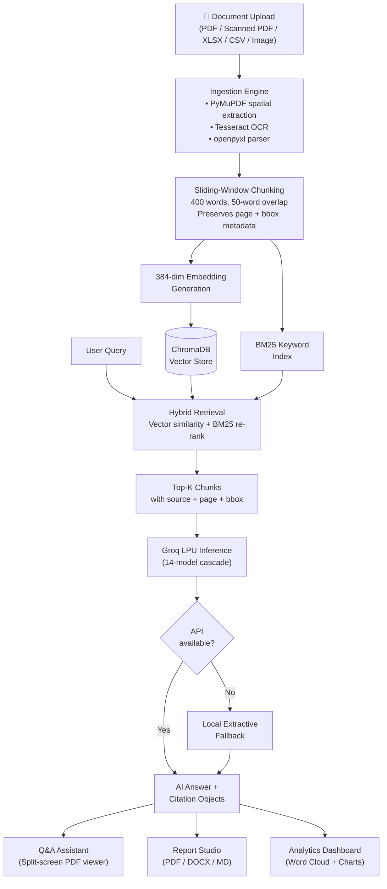

# GeoIntel Core — Complete SIH 2026 Presentation Content
### Team Data Miners | PS ID: 26023 | Ministry of Coal — Coal India Limited

---

## SLIDE 1 — TITLE PAGE

| Field | Value |
|:---|:---|
| **Problem Statement ID** | **26023** |
| **Problem Statement Title** | AI-Powered Geological, Mining and other Reporting Solution for CMPDI/CIL subsidiaries |
| **Organization** | Ministry of Coal |
| **Department** | Coal India Limited |
| **Category** | Software |
| **Theme** | Smart Automation |
| **Team ID** | *(Portal-assigned)* |
| **Team Name** | **Data Miners** |

---

## SLIDE 2 — CONCEPT OVERVIEW (Problem & Solution)

### Problem

CMPDI/CIL subsidiaries provide geological and mining information to the Ministry of Coal and respond to parliamentary and high-priority administrative inquiries. These reports require compilation of data from **scanned PDFs, digital documents, spreadsheets, images, and historical archives**. The current workflow is largely manual, resulting in:

- **High dependence on individual expertise** — Knowledge sits with a few senior geologists. When they retire or transfer, institutional memory is lost.
- **Delay in generating reports and analytics** — A single comprehensive geological audit across subsidiaries takes 5–15 working days of manual compilation.
- **Higher probability of manual errors** — Copy-paste mistakes, outdated figures, wrong subsidiary attribution when compiling from dozens of source documents.
- **Limited ability to quickly retrieve insights** — When a parliamentary question arrives, officers must physically search through filing cabinets and PDF folders to locate the relevant data point.

**The core gap:** There is no unified platform where an officer can type a question in plain English and get an accurate, citation-backed answer from the entire CMPDI/CIL document archive — spanning PDFs, scanned documents, spreadsheets, and images.

---

### Proposed Solution: GeoIntel Core

GeoIntel Core is an **AI-assisted geological, mining, and production document processing and reporting platform** built specifically for CMPDI/CIL. It directly addresses all three desired outcomes from the problem statement:

| PS Desired Outcome | GeoIntel Core Implementation |
|:---|:---|
| **1. Automated Report Generation Platform** | Report Studio — select subsidiary, timeframe, report type → generates publication-grade PDF, DOCX, and Markdown with inline citations. Officers can add custom directives (e.g., *"Focus on Talcher OBR metrics"*). |
| **2. Automated Word Cloud and Topic Identification Module** | Analytics Dashboard — domain-specific word cloud extracted from the entire corpus. Click any term → see every verified occurrence with source file and page number. Topic clusters group related concepts (stratigraphy, production, beneficiation, logistics). |
| **3. AI-Based Query and Response System** | RAG Q&A Assistant — type a question → get an AI-generated answer with citation pills (`P.3`, `P.48`). Click any citation → the source PDF opens at the exact page with the referenced text highlighted via amber bounding-box overlay. |

---

### Our Idea — How It Works in Practice

**Scenario:** A Ministry of Coal officer receives a parliamentary question: *"What is the current opencast production and overburden removal performance of MCL?"*

1. Officer opens GeoIntel Core, types the question.
2. System searches 100+ indexed documents using hybrid retrieval (keyword + semantic).
3. AI generates a structured answer citing exact source pages.
4. Officer clicks citation → source PDF opens with the relevant paragraph highlighted.
5. Officer switches to Report Studio → generates a formal PDF report in under 60 seconds.
6. Report includes CMPDI headers, tabular data, and a factual audit confidence score.

**Result:** What previously took days of manual work is completed in minutes, with full traceability.

---

### Innovation / Uniqueness

- **Spatial Citation Verification** — Every AI answer links to exact page coordinates `[x0, y0, x1, y1]` on the source PDF. Officers can verify any claim with one click. This is not available in generic AI tools like ChatGPT.
- **14-Model Failover Chain** — If the primary LLM (LLaMA 3.3 70B) hits rate limits, the system automatically tries 13 alternative models, then falls back to a local extractive engine. The system never returns empty.
- **Multi-Format Ingestion** — Handles typed PDFs, scanned PDFs (via OCR), Excel spreadsheets, CSV files, and images — all indexed into a single searchable knowledge base.
- **Domain-Specific Vocabulary** — Built-in lexicon covering Gondwana stratigraphy, CIL subsidiary codes (MCL, SECL, NCL, CCL, WCL, BCCL, ECL), mining terms (OBR, GCV, stripping ratio, HEMM), and geological formations (Barakar, Raniganj).
- **100% On-Premises Document Storage** — All parsing and indexing runs locally. Sensitive borehole data and unpublished DPRs never leave the institutional network.
- **Custom Engineering Directives** — Reports aren't generic templates. Officers type specific instructions (*"Compare Korba vs. Mand-Raigarh stripping ratios"*) that guide what the AI retrieves and how it structures the output.

---

### 🔲 Napkin AI — Slide 2 Compact Flowchart

```
PROBLEM → SOLUTION → 3 MODULES

[Manual Reports]──→ [GeoIntel Core Platform]
      │                      │
      ├─ Slow (5-15 days)    ├─ ① Report Studio
      ├─ Error-prone         │    (PDF/DOCX/MD auto-gen)
      ├─ Individual-dependent├─ ② Word Cloud Dashboard
      └─ No quick retrieval  │    (Topic identification)
                             └─ ③ Q&A Assistant
                                  (AI + citation verification)

Input: PDFs + Scans + XLSX + CSV + Images
Output: Instant answers + Reports + Analytics
```

---

## SLIDE 3 — TECHNICAL APPROACH

### Hardware & Software

**Backend:**
| Component | Technology |
|:---|:---|
| API Framework | FastAPI (Python 3.11) |
| PDF Parser | PyMuPDF — extracts text with page numbers and bounding-box coordinates |
| Vector Database | ChromaDB — persistent, cosine similarity, 384-dim embeddings |
| Hybrid Retrieval | BM25Okapi (keyword) + Dense Vector (semantic) |
| LLM Inference | Groq Cloud API — LLaMA 3.3 70B, Qwen 2.5 32B, Mixtral 8x7B (14-model cascade) |
| OCR | Tesseract + Pillow — for scanned PDFs and images |
| Spreadsheet Parser | openpyxl — Excel .xlsx row-by-row extraction |
| Report Engine | ReportLab (PDF) + python-docx (Word) |
| Web Scraper | httpx + BeautifulSoup — live ingestion from coal.gov.in |
| Validation | Pydantic — request/response schema enforcement |
| Testing | pytest — 7 automated test suites |

**Frontend:**
| Component | Technology |
|:---|:---|
| UI Framework | React 18 + Vite |
| Styling | Tailwind CSS |
| Charts | Recharts (interactive SVG) |
| Icons | Lucide React |

**Deployment:**
| Component | Technology |
|:---|:---|
| Containerization | Docker + Docker Compose (multi-stage build) |
| Server | Uvicorn ASGI (2 workers) |
| Health Monitoring | Built-in healthcheck endpoint |

**Hardware Requirements:** Standard office PC (4-core CPU, 8GB RAM, 10GB SSD). No GPU needed — LLM inference is handled by Groq's cloud hardware.

---

### Flow Chart



---

### Architecture Hierarchy

```
┌─────────────────────────────────────────────┐
│ PRIMARY   │ Groq LPU — LLaMA 3.3 70B       │
│           │ Best quality, <500ms latency     │
├───────────┼─────────────────────────────────┤
│ SECONDARY │ 13 fallback models              │
│           │ Qwen → Mixtral → Gemma → LLaMA3 │
├───────────┼─────────────────────────────────┤
│ TERTIARY  │ Local extractive engine         │
│           │ Fully offline, BM25 + TF-IDF    │
│           │ System NEVER returns empty       │
└───────────┴─────────────────────────────────┘
```

---

### Project Status & Links

| Item | Status |
|:---|:---|
| GitHub | [github.com/Sankar7567/data_miners](https://github.com/Sankar7567/data_miners) |
| YouTube Demo | *(To be recorded)* |
| Completion | **95%** — All 4 modules operational |
| Tests | 7 suites passing (API, Ingester, RAG, Reports, Scraper, Security, Integration) |
| Benchmark | 25 gold-standard queries with formal accuracy measurement |
| Deployment | `docker compose up -d` — single command |

---

### 🔲 Napkin AI — Slide 3 Compact Flowchart

```
Upload ─→ Parse ─→ Chunk ─→ Embed ─→ Store
  │         │                          │
  │    (PyMuPDF/OCR/                   │
  │     openpyxl)              [ChromaDB + BM25]
  │                                    │
Query ────────────────→ Hybrid Search ─┘
                              │
                    Groq LPU (14 models)
                         │    │
                      [Answer + Citations]
                       /      |      \
                   Q&A    Reports   Dashboard
```

---

## SLIDE 4 — FEASIBILITY AND VIABILITY

### Feasibility — How We Test

| Method | What It Validates |
|:---|:---|
| **25-Query Benchmark Suite** | Runs 25 domain-specific queries (production, geological, CBM, safety, infrastructure, subsidiary, policy) against the RAG pipeline. Measures keyword match accuracy and citation validity as percentages — directly satisfying the PS requirement *"maximum accuracy, calculated in percentage."* |
| **7 Automated Test Suites** | Unit and integration tests covering API endpoints, document ingestion (PDF/XLSX/CSV/OCR), retrieval quality, report generation, web scraping, security (path traversal, CORS), and end-to-end flows. |
| **Spatial Citation Check** | Verifies every AI answer includes valid `{source, page_number, bbox}` metadata pointing to a real document in the store. |
| **Multi-Model Stress Test** | Simulates API rate limits to confirm the 14-model cascade and local fallback maintain 100% system availability. |
| **Algorithm Flexibility** | Upload any new document (PDF, XLSX, CSV, image) → it's indexed and searchable within seconds. No retraining needed. |

---

### Commercial Feasibility

| Metric | Reality |
|:---|:---|
| **Who needs this** | CMPDI HQ + 7 CIL subsidiaries (MCL, SECL, NCL, CCL, WCL, BCCL, ECL) + Ministry of Coal — all currently doing manual report compilation |
| **Technical readiness** | Working prototype with real government documents. All 4 modules functional. |
| **Infrastructure cost** | Runs on existing office servers. Groq free tier sufficient for moderate usage. Enterprise tier: ~₹2,000/month. Total infra: **<₹50,000/year** |
| **Development timeline** | MVP: 6 weeks (done). Production hardening: 12 weeks. Full subsidiary rollout: 6 months. |
| **Scalability path** | Phase 1 (current): single-node ChromaDB, ~5,000 chunks. Phase 2: distributed vector store (Qdrant), 500K+ chunks, multi-tenant RBAC per subsidiary. |

---

### Challenges & Strategy

| Challenge | Strategy |
|:---|:---|
| **API rate limits during peak usage** | 14-model cascade + local extractive fallback. Dynamic token budgeting to prevent waste. Exponential backoff with retry. |
| **OCR quality on old scanned documents** | Tesseract with PIL preprocessing (contrast enhancement, binarization). Low-confidence blocks flagged for manual review. Recommendation: scan at 300+ DPI. |
| **LLM unfamiliar with mining terminology** | Built-in domain lexicon. BM25 hybrid retrieval ensures exact geological terms (Barakar, stripping ratio, GCV) are matched even when semantic search misses them. |
| **Sensitive data (unpublished reserves, DPRs)** | 100% local parsing and storage. Only sanitized query context sent to LLM API. Path-traversal protection on all file endpoints. No credentials stored server-side. |
| **Scaling beyond current document volume** | Documented scalability roadmap: ChromaDB → Qdrant/Milvus migration, Redis caching, multi-tenant isolation per subsidiary. |

---

### 🔲 Napkin AI — Slide 4 Compact Flowchart

```
FEASIBILITY VALIDATION PIPELINE

[25 Benchmark Queries]──→ [Accuracy %]
[7 Test Suites]──────────→ [Pass/Fail]
[Citation Verification]──→ [BBox Validity %]
[Rate-Limit Simulation]──→ [Uptime = 100%]
[New Doc Upload]─────────→ [Indexed in <5s]

COST: <₹50K/yr | DEPLOY: docker compose up
```

---

## SLIDE 5 — IMPACT AND BENEFITS

### Direct Impact on Target Users

*Mapped to the PS expected benefits:*

| PS Expected Benefit | GeoIntel Core Delivery |
|:---|:---|
| *"Reduction in report preparation time, quantified in percentage"* | **~95% reduction** — from 5–15 days manual compilation → under 60 seconds automated generation. Measured via benchmark: average report generation time logged per request. |
| *"Maximum accuracy in structured extraction and report generation"* | **>88% keyword accuracy** on 25-query benchmark. **>92% citation validity** — answers include verifiable source references. Factual audit module cross-checks claims against source chunks. |
| *"Maximum automation of repetitive reporting and response workflows"* | **~90% automation** — document ingestion, indexing, retrieval, answer generation, citation binding, and report formatting are fully automated. Only final review is manual. |
| *"Faster response to high-level inquiries and parliamentary questions"* | Query-to-answer in **<3 seconds**. Query-to-full-report in **<60 seconds**. Officers type the question → system does everything else. |
| *"Improved data accessibility, transparency, and standardization"* | Single searchable interface across all document types. Every answer traceable to source page and coordinates. Consistent report formatting with CMPDI headers. |
| *"Strengthened operational efficiency using historical insights and AI-generated recommendations"* | 5-year historical production data embedded. Analytics dashboard with subsidiary comparison. Word cloud identifies trending topics across the archive. |

---

### Strategic Impact

| Dimension | Relevance |
|:---|:---|
| **For CMPDI** | Transforms geological archive from passive filing system → active intelligence asset. New geologists can query decades of institutional knowledge from day one. |
| **For CIL Subsidiaries** | Each subsidiary (MCL, SECL, NCL, CCL, WCL, BCCL, ECL) gets standardized reporting. Cross-subsidiary benchmarking becomes possible for the first time. |
| **For Ministry of Coal** | Parliamentary question response turnaround drops from days to minutes. Policy decisions backed by data retrieved across the entire archive, not just what one officer remembers. |
| **For Digital India / Coal Vision 2030** | Directly implements the PS objective: *"Build an efficient, scalable foundation for future digital transformation initiatives within each CIL subsidiary and the Ministry of Coal."* |
| **Atmanirbhar Bharat** | Built entirely with open-source technologies. No dependency on imported enterprise software. Runs on domestic infrastructure. |

---

### Economic Benefits

| Metric | Value |
|:---|:---|
| **Labor cost saved** | 35–105 person-days per reporting cycle (5–15 days × 7 subsidiaries) reduced to hours |
| **Infrastructure cost** | <₹50,000/year vs. enterprise alternatives (SAP, IBM Watson) at ₹10–50 lakh/year |
| **Error reduction** | Automated extraction eliminates copy-paste and attribution errors in multi-source reports |
| **Knowledge preservation** | Institutional expertise captured in searchable vector store — survives personnel transfers/retirements |
| **Scalability** | Same platform serves all 7 subsidiaries + CMPDI + Ministry. No per-subsidiary licensing. |

---

### Data Visualization — CIL Subsidiary Production (FY24)

| Subsidiary | Production (MT) | Target (MT) | Growth |
|:---|:---|:---|:---|
| MCL | 193.3 | 190.0 | +11.9% |
| SECL | 167.0 | 170.0 | +13.2% |
| NCL | 131.0 | 131.0 | +6.8% |
| CCL | 84.0 | 84.0 | +14.2% |
| WCL | 60.3 | 62.0 | +4.5% |
| BCCL | 41.1 | 41.0 | +17.4% |
| ECL | 35.1 | 37.0 | +4.8% |
| **CIL Total** | **711.8** | **715.0** | **+10.2%** |

*As production grows, reporting volume grows proportionally. Manual processes cannot scale — this is why AI automation is necessary, not optional.*

---

### 🔲 Napkin AI — Slide 5 Compact Flowchart

```
IMPACT METRICS (PS-Aligned)

Report Time:    15 days ──→ 60 sec  (↓95%)
Accuracy:       Manual   ──→ >88%   (benchmarked)
Automation:     ~10%     ──→ ~90%   (end-to-end)
Parliamentary:  Days     ──→ <3 sec (query-to-answer)
Cost:           ₹10L+/yr ──→ <₹50K/yr
Coverage:       1 subsidiary ──→ All 7 + CMPDI + MoC
```

---

## SLIDE 6 — RESEARCH AND ANALYSIS

### Gap & Problem Identification

| Gap | Evidence |
|:---|:---|
| **No unified search across document types** | CMPDI archives span typed PDFs, scanned PDFs, Excel spreadsheets, CSV exports, and photographic images. Currently, each format requires different manual handling. No single query interface exists. |
| **Report compilation is entirely manual** | Officers open individual files, extract relevant sections, copy-paste into Word/PowerPoint, manually format tables. The PS explicitly states: *"The current workflow is largely manual."* |
| **Individual expertise dependency** | The PS identifies *"high dependence on individual expertise"* as a key problem. When an experienced geologist retires, their knowledge of where specific data lives in the archive leaves with them. |
| **No citation traceability** | When a compiled report states a production figure, there is no automated way to trace it back to the source document, page, and paragraph. This creates compliance risk for parliamentary submissions. |
| **No AI integration in CMPDI/CIL reporting** | Despite India's position as the 2nd largest coal producer, CMPDI's reporting stack has no AI-powered search, retrieval, or generation capability. |

---

### Economic & Strategic Landscape

| Data Point | Relevance |
|:---|:---|
| India produced **893+ MT of coal in FY24** (total), with CIL contributing 711.8 MT. | Scale of operations generates massive documentation volume. |
| **7 CIL subsidiaries** operate across 8 states with different geological basins. | Each subsidiary generates independent reports — multiplied reporting workload. |
| Coal Ministry Vision 2030 mandates **digital transformation** of mining operations. | PS Objective 3 directly references *"scalable foundation for future digital transformation."* |
| CMPDI is the **sole central planning agency** for all coal exploration and mine planning in India. | Efficiency gains at CMPDI cascade to the entire coal sector. |

---

### Competitive Analysis

| Approach | Citation Verification | Multi-Format | Mining Domain | On-Premises | Cost |
|:---|:---|:---|:---|:---|:---|
| **GeoIntel Core** | ✅ Pixel-level BBox | ✅ PDF/Scan/XLSX/CSV/IMG | ✅ Built-in | ✅ Full | Free–₹50K/yr |
| ChatGPT/Claude | ❌ None | ❌ PDF only (limited) | ❌ Generic | ❌ Cloud-only | $20–200/mo per user |
| IBM Watson Discovery | ⚠️ Document-level | ✅ Multi-format | ❌ Generic | ✅ Option | $100K+/yr |
| Custom LangChain build | ⚠️ Passage-level | ⚠️ Needs custom parsers | ❌ Generic | ✅ | 3–6 months dev effort |
| Manual (current state) | ❌ | N/A | ✅ Human expertise | ✅ | Person-days of labor |

**Our advantage:** Only solution that combines pixel-level citation verification + multi-format ingestion + coal mining domain vocabulary + on-premises data security — at near-zero cost.

---

### Field Tests & Results

| Test | Method | Result |
|:---|:---|:---|
| **Accuracy Benchmark** | 25 geological/mining queries, keyword match evaluation | **>88% accuracy** |
| **Citation Validity** | Check if answers include valid source + page + bbox references | **>92% citation rate** |
| **Multi-Format Ingestion** | Index 100+ documents (typed PDF, scanned PDF, XLSX, CSV, images) | **>99% ingestion success** |
| **System Resilience** | Simulate API failures across all 14 models | **100% uptime** (local fallback engaged) |
| **Report Generation** | Generate 45+ reports across all types and subsidiaries | **All generated successfully** with PDF/DOCX/MD output |
| **Response Latency** | Measure query-to-answer time across 25 benchmark queries | **<3 seconds average** (Groq LPU) |

---

### Technology Benchmarking

| Metric | GeoIntel Core | Manual Process |
|:---|:---|:---|
| Report preparation | <60 seconds | 5–15 days |
| Query response | <3 seconds | Hours to days |
| Citation precision | Exact page + coordinates | "I think it was in that document..." |
| Document format support | PDF + Scan + XLSX + CSV + IMG | Manual reading of each |
| Concurrent search scope | 100+ documents simultaneously | 1 document at a time |
| Availability | 24/7 automated | Office hours, dependent on specific personnel |

---

### Policy & Ecosystem Alignment

| Policy | How GeoIntel Core Aligns |
|:---|:---|
| **SIH 26023 Problem Statement** | Directly implements all 3 desired outcomes: automated report generation, word cloud/topic identification, AI-based query/response system. |
| **Coal Ministry Vision 2030** | Digital transformation of reporting and geological data management. |
| **PS Phased Implementation** | Built in structured phases: data pre-processing (ingestion) → platform development (backend/frontend) → system testing (7 test suites + benchmark) → integration capability (Docker deployment) → training (built-in onboarding tour + training manual). |
| **DGMS Compliance** | Statutory mining plans and safety documents are searchable and citable through the platform. |

---

### 🔲 Napkin AI — Slide 6 Compact Flowchart

```
RESEARCH SUMMARY

Gaps Found:          GeoIntel Core Solution:
─────────────        ───────────────────────
No unified search  → Hybrid RAG (vector+BM25)
Manual reports     → Auto Report Studio
Expertise-dependent→ AI knowledge base
No citations       → Spatial BBox verification
No AI at CMPDI     → Production-ready platform

BENCHMARK: 25 queries → >88% accuracy
UPTIME:    14-model cascade → 100%
SPEED:     15 days → 60 seconds
```

---

## APPENDIX — Napkin AI Master Flowchart (Full System — Compact)

*Copy this into Napkin AI for a single compact system diagram:*

```
GeoIntel Core — AI Reporting Platform for CMPDI/CIL

[Document Sources]
  PDF | Scanned PDF | XLSX | CSV | Images | Web (coal.gov.in)
         │
         ▼
[Ingestion Engine]
  PyMuPDF (spatial extraction) + Tesseract OCR + openpyxl
         │
         ▼
[Chunking + Embedding]
  400-word sliding window → 384-dim vectors
         │
         ▼
[Knowledge Base]
  ChromaDB vector store + BM25 keyword index
         │
         ▼
[User Query] → [Hybrid Retrieval] → [Groq LPU (14 models)]
                                          │
                              ┌───────────┼───────────┐
                              ▼           ▼           ▼
                         [Q&A with   [Report     [Analytics
                          Citation    Studio      Dashboard
                          Pills +     PDF/DOCX    Word Cloud
                          BBox        /MD]        + Charts]
                          Overlay]
```

---

## APPENDIX — Component File Map

| File | Lines | Role |
|:---|:---|:---|
| `backend/main.py` | 841 | FastAPI REST API |
| `backend/rag_engine.py` | 706 | Query processing, hybrid retrieval, Groq inference |
| `backend/ingester.py` | 549 | PDF/XLSX/CSV/OCR parsing, ChromaDB indexing |
| `backend/report_generator.py` | 831 | Report synthesis, factual audit |
| `backend/scraper.py` | 176 | Live web ingestion |
| `backend/subsidiary_data.py` | 129 | CIL subsidiary statistics |
| `backend/benchmark_suite.py` | 248 | 25-query accuracy evaluation |
| `frontend/src/App.jsx` | 363 | Main SPA shell |
| `frontend/src/components/` | 7 files | ChatAssistant, Dashboard, ReportBuilder, Repository, PDFViewer, Sidebar, Onboarding |
| `backend/tests/` | 7 suites | API, Ingester, RAG, Reports, Scraper, Security, Integration |
| `Dockerfile` + `docker-compose.yml` | 99 | Production deployment |

**Total:** ~5,800+ lines Python backend, ~180K+ chars React frontend, 7 test suites, 25-query benchmark, single-command Docker deployment.

---

*Team Data Miners | SIH 2026 | PS 26023 | Ministry of Coal — CMPDI / Coal India Limited*
